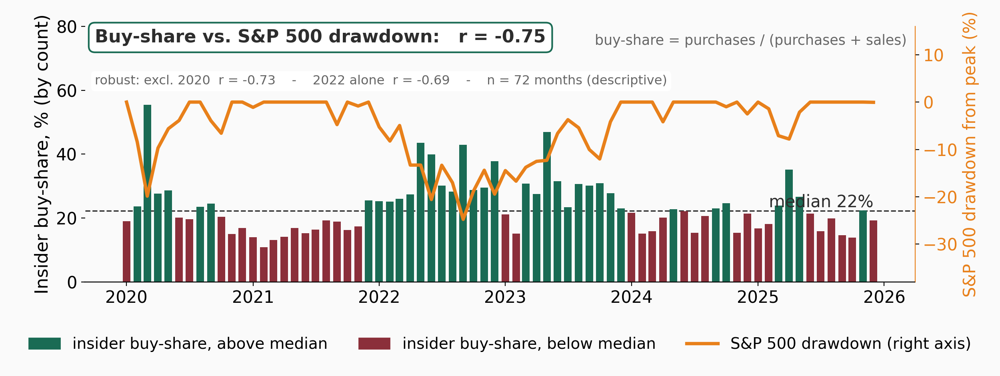
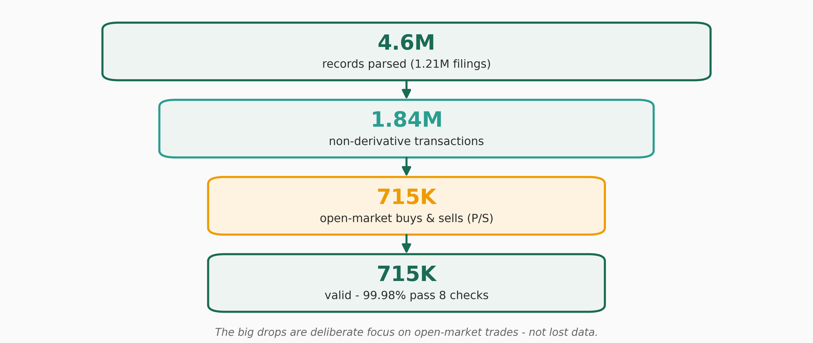

# SEC Form 4 Data Pipeline

Automated pipeline that downloads, processes, validates, and analyzes
**SEC Form 4 insider-transaction data** for 2020–2025.

Built for the *IT for Finance* course at TH Köln. The database layer uses the
**Django ORM** (PostgreSQL or SQLite — SQLite by default locally) — Django is
used purely as an ORM, there is no web frontend, login, or admin panel.

---

## Quick start

```bash
# 1. Python 3.12+ and dependencies
pip install -r requirements.txt

# 2. Configuration
cp .env.example .env          # then edit it (see below)

# 3. Run the whole pipeline
python main.py                # all years (2020-2025)
python main.py --year 2024    # a single year
python main.py --years 2022-2024
```

`main.py` is the only command you need — it applies the database migrations
automatically on startup, so a fresh checkout works in one step.

**No PostgreSQL server?** Use the local SQLite fallback: set
`DB_ENGINE=django.db.backends.sqlite3` and `DB_NAME=local.sqlite3` in `.env`.
Everything then runs against a single local file — no server, no credentials.
See `docs/sqlite_fallback_und_tests.md`.

---

## What it does

The pipeline runs six phases, end to end and idempotent (safe to re-run):

1. **Download** – fetch the quarterly ZIP files from SEC EDGAR (2020–2025 by
   default, configurable via `START_YEAR`/`END_YEAR` in `.env`)
2. **Parse** – unpack the ZIPs and read the TSV/JSON files into DataFrames
3. **Prepare** – clean, type-convert, and merge owner data
4. **Load** – import everything through the Django ORM (delete-then-insert)
5. **Validate** – 8 plausibility checks (4 mandatory + 4 bonus)
6. **Evaluate** – generate monthly charts, CSV tables, and a PDF report

Scale: ~4.6 million rows across 24 quarters and 7 tables.

---

## Output

Results are grouped per year under `output/<year>/`:

- `output/<year>/<year>_evaluation_report.pdf` – full annual report
- `output/<year>/charts/monthly/<MM>/` – Top-5/Bottom-5 bar charts (purchases + sales, 3 metrics)
- `output/<year>/charts/overview/` – trend, sentiment, and repeat-sellers heatmap
- `output/<year>/tables/monthly/<MM>/` – CSV exports of the ranking data
- `output/presentation/` – board-slide charts (generated by `analysis/`, see below)
- `logs/pipeline.log` – detailed run log

---

## Project structure

```
ITFF-THKOELN/
├── main.py                  Entry point — runs the 6-phase pipeline
├── manage.py                Django management commands (migrate, test, …)
├── config.py                Non-sensitive config (SEC URL, paths, colors, year range)
├── requirements.txt         Python dependencies
├── .env.example             Template for credentials / settings → copy to .env
├── CLAUDE.md                Project rules
├── Plan.md                  Current task list
│
├── modules/                 Pipeline logic
│   ├── downloader.py          SEC ZIP download (retry logic)
│   ├── parser.py              ZIP extraction + TSV/JSON parsing
│   ├── data_preparation.py    cleaning, type conversion, owner merge
│   ├── db_manager.py          idempotent import via the Django ORM
│   ├── validation.py          8 plausibility checks
│   └── evaluation.py          charts, CSV export, PDF report
│
├── pipeline/                Django app (ORM only)
│   ├── models.py              the 7 database tables
│   ├── migrations/            schema migrations
│   └── tests/                 unit-test suite
│
├── secpipeline/             Django project config
│   └── settings.py            DB connection from .env (PostgreSQL / SQLite)
│
├── analysis/                Analysis + chart generation (audience-facing visuals)
│   ├── v2_findings.py             insider buy-share vs S&P 500 drawdown (the key finding)
│   ├── v2_diagrams.py             schematic graphics: Form 4 primer, anatomy, pipeline, data funnel
│   └── sp500_monthly.csv          S&P 500 monthly closes (chart input, Yahoo Finance)
│
├── output/                  Generated results
│   ├── <year>/                2020 … 2025
│   │   ├── <year>_evaluation_report.pdf
│   │   ├── charts/
│   │   │   ├── monthly/<MM>/   Top-5/Bottom-5 bar charts
│   │   │   └── overview/       trend · sentiment · heatmap
│   │   └── tables/monthly/<MM>/  CSV rankings
│   └── presentation/          analysis charts (PNG) the slides are built from
│
├── docs/                    Task documentation (German)
├── notes/                   Misc notes + archived plan
└── assets/                  TH Köln logos
```

---

## Analysis & charts (Task 1)

`analysis/` turns the populated database into the figures shown to the
audience — kept separate from the pipeline, so it never touches the pipeline
code:

```bash
python analysis/v2_findings.py     # insider buy-share vs S&P 500 drawdown (the key finding)
python analysis/v2_diagrams.py     # Form 4 primer, filing anatomy, pipeline, data funnel
```

All figures are written to `output/presentation/`.

### Key finding

Across 2020–2025 the monthly **insider buy-share** — purchases / (purchases +
sales), by count — moves inversely with the S&P 500 drawdown: **when the
market falls, insiders buy.** The association is strong (r = −0.75, n = 72
months) and is not a single-episode artefact — it holds excluding COVID-2020
(r = −0.73) and in 2022 alone (r = −0.69).



From 4.6M parsed records the analysis narrows to the ~715K open-market buy/sell
transactions behind the signal:



---

## Testing

The project ships a unit-test suite (Django's built-in runner — no extra
package). Tests run against a throwaway SQLite database, so they need neither
the PostgreSQL server nor internet access:

```bash
python manage.py test
```

Make sure the SQLite fallback is active in `.env` (see Quick start). The suite
covers data preparation, all eight validation checks, the parser, the
downloader (network mocked), the idempotent import, evaluation, and the models.
See `docs/sqlite_fallback_und_tests.md`.

---

## Notes

- DB credentials live in `.env`, never in the code (`.env` is git-ignored).
- The first run downloads ~200 MB of ZIP files from SEC; later runs skip existing files.
- Re-running deletes and re-imports all data (delete-then-insert), so the DB
  always reflects the latest processing. `pipeline_log` is never deleted — it
  keeps a full audit trail.

---

## Current status

- **Task 1 (Setup):** done, except entering the real PostgreSQL credentials (placeholders in `.env` for now).
- **Task 2 (Django migration):** code migration from SQLAlchemy/MySQL to Django ORM/PostgreSQL complete; passes all offline checks. End-to-end run verified on the SQLite fallback (4.6M rows). See `docs/django_migration.md`.
- **Task 3 (Docstrings):** done. See `docs/docstring_guidelines.md`.
- **Task 4 (Flexible config):** done — all hardcoded values moved to `config.py`/`.env`. See `docs/configuration.md`.
- **Task 5 (Multi-year history):** done — covers 2020–2025, with `--year`/`--years` flags. See `docs/multi_year_extension.md`.
- **Task 6 (Code review):** done — file-by-file review, test suite green. See `docs/code_review.md`.

The project has moved into a follow-up phase — **presentation** (`analysis/`,
`output/presentation/`), **Plan-B server research** (`docs/plan_b_server.md`),
and the final **PostgreSQL migration**. See `Plan.md` for the current task list.
